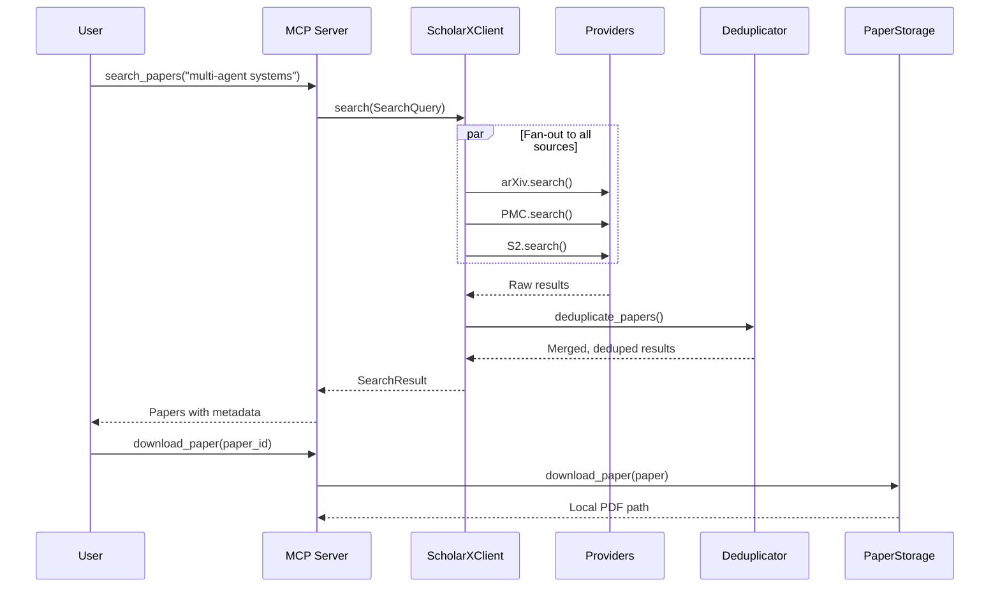

# AGENTS.md

## Tech Stack & Architecture
- Language/Version: Python 3.11+
- Core Libraries: `agent-utilities`, `fastmcp`, `pydantic`, `httpx`
- Key principles: Per-source rate limiting, 3-tier deduplication, full paper storage, existing KG node types.
- Architecture:
    - `mcp_server.py`: MCP server entry point with 12 tools across 3 tag groups.
    - `agent_server.py`: Graph agent server for autonomous operation.
    - `api_client.py`: Unified client — fan-out to all providers, dedup, merge.
    - `providers/`: One module per paper source (arXiv, PMC, bioRxiv, OSF, S2).
    - `kg_integration.py`: Bridges papers into existing KG via KBIngestionEngine.

### Architecture Diagram


### Workflow Diagram


## Commands (run these exactly)
# Installation
pip install .[all]

# Quality & Linting (run from project root)
SKIP=no-commit-to-branch,uv-lock pre-commit run --all-files

# Execution Commands
# scholarx-mcp    → scholarx.mcp_server:mcp_server
# scholarx-agent  → scholarx.agent_server:agent_server

# Testing
pytest tests/ -v

## Project Structure Quick Reference
- MCP Entry Point → `mcp_server.py`
- Agent Entry Point → `agent_server.py`
- Unified Client → `api_client.py`
- Provider Layer → `providers/`
- Deduplication → `deduplication.py`
- Paper Storage → `paper_storage.py`
- KG Bridge → `kg_integration.py`
- Models → `models.py`

### File Tree
```text
scholarx/
├── __init__.py              # Lazy imports (servicenow-api pattern)
├── __main__.py              # CLI entry point
├── models.py                # Paper, PaperSource, SearchQuery, SearchResult
├── api_client.py            # ScholarXClient — unified entry point
├── deduplication.py          # DOI → cross-ID → fuzzy title+author
├── paper_storage.py          # Full PDF download + local storage
├── kg_integration.py         # ScholarXKGBridge → KBIngestionEngine
├── mcp_server.py             # 12 tools + 2 analysis prompts
├── agent_server.py           # Graph agent server
├── main_agent.json           # Agent identity
├── mcp_config.json           # MCP client config
└── providers/
    ├── base.py               # Abstract PaperProvider + rate limiter
    ├── arxiv.py              # arXiv Atom API
    ├── pmc.py                # NCBI E-utilities
    ├── biorxiv.py            # bioRxiv + medRxiv API
    ├── osf.py                # OSF + PsyArXiv API
    └── semantic_scholar.py   # S2 Academic Graph API
```

## Code Style & Conventions
**Always:**
- Use `agent-utilities` for common patterns (e.g., `create_mcp_server`, `create_graph_agent_server`).
- Define models using Pydantic with descriptive docstrings.
- Use per-source rate limiting via the `PaperProvider` base class.
- Lazy-import agent-utilities KG types inside functions (they're optional deps).

**Good example:**
```python
from scholarx.api_client import ScholarXClient
from scholarx.models import SearchQuery

client = ScholarXClient()
result = await client.search(SearchQuery(query="attention mechanisms"))
for paper in result.papers:
    print(f"{paper.title} ({paper.source})")
```

## Dos and Don'ts
**Do:**
- Run `pre-commit` before pushing changes.
- Use existing KG node types (ArticleNode, SourceNode, PersonNode).
- Add new sources by subclassing `PaperProvider`.
- Use `SearchQuery` for all search operations.

**Don't:**
- Call provider APIs directly — always go through `ScholarXClient`.
- Hardcode API keys — use environment variables (`OSF_TOKEN`, `S2_API_KEY`, `NCBI_API_KEY`).
- Create new KG node types — use existing patterns.
- Skip rate limiting — all providers must use `_wait_for_rate_limit()`.

## Safety & Boundaries
**Always do:**
- Run lint/test via `pre-commit`.
- Use the `PaperProvider` base class for new sources.

**Ask first:**
- Adding new paper sources.
- Changing deduplication thresholds.
- Modifying the KG bridge node mapping.

**Never do:**
- Commit `.env` files or API keys.
- Bypass per-source rate limiting.
- Modify `agent-utilities` models from within this package.


## Testing with Timeout

To run tests with a timeout to prevent hanging, use the `pytest-timeout` plugin. You can combine it with the `-k` flag to run specific tests:

```bash
uv run pytest --timeout=60 -k "test_name_pattern"
```
