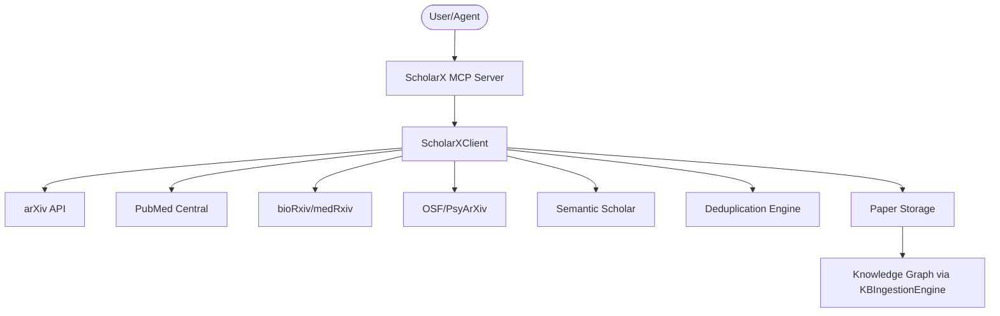
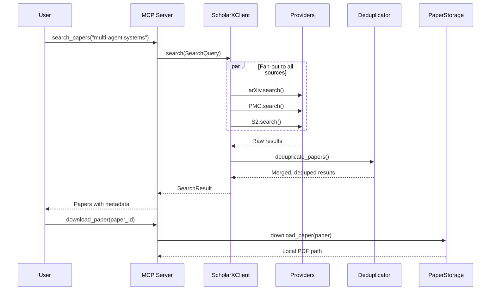

# AGENTS.md

<!-- CONCEPT:SX-1.0 CLI — Rich terminal interface with progress bars, scan/status commands -->
<!-- CONCEPT:SX-1.1 Relevance Scoring — Delegated to research-scanner skill with dynamic_scorer.py -->
<!-- CONCEPT:SX-1.2 3-Tier Deduplication — DOI exact match → cross-ID mapping → fuzzy title+author (Levenshtein ≥ 0.90) -->
<!-- CONCEPT:SX-1.3 Storage Dedup — PaperStorage skips already-downloaded PDFs via metadata hash lookup -->
<!-- CONCEPT:SX-1.4 Auto-Analysis — --analyze flag chains comparative-analysis innovation extraction on relevant papers -->
<!-- CONCEPT:SX-1.5 Category OR-Join — arXiv query builder uses OR-joined categories so a paper in ANY listed category matches -->
<!-- CONCEPT:SX-1.6 Background Download Queue — Non-blocking paper downloads via queue.py with job tracking -->

## Tech Stack & Architecture
- Language/Version: Python 3.11+
- Core Libraries: `agent-utilities`, `fastmcp`, `pydantic`, `httpx`, `rich`
- Key principles: Per-source rate limiting, 3-tier deduplication, full paper storage, existing KG node types.
- Architecture:
    - `cli.py`: Rich CLI with progress bars for scan/status commands (CONCEPT:SX-1.0).
    - `mcp_server.py`: MCP server entry point with tools across 3 tag groups (search, discovery, storage).
    - `queue.py`: Background download queue with job tracking and status reporting.
    - `agent_server.py`: Graph agent server for autonomous operation.
    - `api_client.py`: Unified client — fan-out to all providers, dedup, merge.
    - `providers/`: One module per paper source (arXiv, PMC, bioRxiv, OSF, S2).
    - `kg_integration.py`: Bridges papers into existing KG via KBIngestionEngine.

### Architecture Diagram


### Workflow Diagram


## Commands (run these exactly)
```bash
# Installation
pip install .[all]

# Quality & Linting (run from project root)
SKIP=no-commit-to-branch,uv-lock pre-commit run --all-files

# CLI Commands (CONCEPT:SX-1.0)
scholarx scan --query "multi-agent systems" --output-dir ./papers
scholarx scan --categories cs.AI,cs.LG --max-results 50 --output-dir ./papers
scholarx scan --analyze --output-dir ./papers  # Auto-trigger comparative analysis
scholarx status                                 # Show stored paper library

# Entry Points
# scholarx       → scholarx.cli:cli
# scholarx-mcp   → scholarx.mcp_server:mcp_server
# scholarx-agent → scholarx.agent_server:agent_server

# Testing
pytest tests/ -v
```

## Project Structure Quick Reference
- MCP Entry Point → `mcp_server.py`
- Agent Entry Point → `agent_server.py`
- Unified Client → `api_client.py`
- Provider Layer → `providers/`
- Background Queue → `queue.py`
- Deduplication → `deduplication.py`
- Paper Storage → `paper_storage.py`
- KG Bridge → `kg_integration.py`
- Models → `models.py`
- Docker → `docker/`

### File Tree
```text
scholarx/
├── __init__.py              # Lazy imports (servicenow-api pattern)
├── __main__.py              # CLI entry point → cli.py
├── cli.py                    # Rich CLI: scan, status, --analyze (CONCEPT:SX-1.0)
├── models.py                # Paper, PaperSource, SearchQuery, SearchResult
├── api_client.py            # ScholarXClient — unified entry point + queue management
├── queue.py                  # Background download queue with job tracking (CONCEPT:SX-1.6)
├── deduplication.py          # 3-tier dedup: DOI → cross-ID → fuzzy title+author (CONCEPT:SX-1.2)
├── paper_storage.py          # Full PDF download + local storage with dedup (CONCEPT:SX-1.3)
├── kg_integration.py         # ScholarXKGBridge → KBIngestionEngine
├── mcp_server.py             # MCP tools (search, discovery, storage) + 2 analysis prompts
├── agent_server.py           # Graph agent server
├── main_agent.json           # Agent identity
├── mcp_config.json           # MCP client config
└── providers/
    ├── base.py               # Abstract PaperProvider + rate limiter
    ├── arxiv.py              # arXiv Atom API (CONCEPT:SX-1.5 OR-joined categories)
    ├── pmc.py                # NCBI E-utilities
    ├── biorxiv.py            # bioRxiv + medRxiv API
    ├── osf.py                # OSF + PsyArXiv API
    └── semantic_scholar.py   # S2 Academic Graph API
```

## Code Style & Conventions
**Always:**
- Use `agent-utilities` for common patterns (e.g., `create_mcp_server`, `create_graph_agent_server`).
- Define models using Pydantic with descriptive docstrings.
- Use per-source rate limiting via the `PaperProvider` base class.
- Lazy-import agent-utilities KG types inside functions (they're optional deps).

**Good example:**
```python
from scholarx.api_client import ScholarXClient
from scholarx.models import SearchQuery

client = ScholarXClient()
result = await client.search(SearchQuery(query="attention mechanisms"))
for paper in result.papers:
    print(f"{paper.title} ({paper.source})")
```

## Dos and Don'ts
**Do:**
- Run `pre-commit` before pushing changes.
- Use existing KG node types (ArticleNode, SourceNode, PersonNode).
- Add new sources by subclassing `PaperProvider`.
- Use `SearchQuery` for all search operations.

**Don't:**
- Call provider APIs directly — always go through `ScholarXClient`.
- Hardcode API keys — use environment variables (`OSF_TOKEN`, `S2_API_KEY`, `NCBI_API_KEY`).
- Create new KG node types — use existing patterns.
- Skip rate limiting — all providers must use `_wait_for_rate_limit()`.

## Safety & Boundaries
**Always do:**
- Run lint/test via `pre-commit`.
- Use the `PaperProvider` base class for new sources.

**Ask first:**
- Adding new paper sources.
- Changing deduplication thresholds.
- Modifying the KG bridge node mapping.

**Never do:**
- Commit `.env` files or API keys.
- Bypass per-source rate limiting.
- Modify `agent-utilities` models from within this package.


## Testing with Timeout

To run tests with a timeout to prevent hanging, use the `pytest-timeout` plugin. You can combine it with the `-k` flag to run specific tests:

```bash
uv run pytest --timeout=60 -k "test_name_pattern"
```
