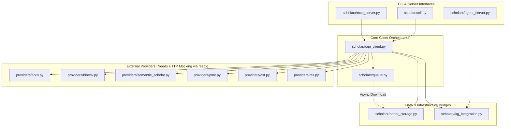

# ScholarX Pytest Coverage Analysis & Remediation Report

This report provides a comprehensive analysis of the overall code coverage in `scholarx`, maps specific testing gaps, and outlines highly actionable opportunities and code patterns to achieve the **100% test coverage North Star goal**.

---

## 📊 Current Coverage Dashboard

> [!NOTE]
> Currently, the overall test coverage stands at **27%** across **1,749 statements**, with **1,282 statements missed**. While core utilities like `models.py` and `deduplication.py` have excellent test suites, high-impact modules like `mcp_server.py`, `kg_integration.py`, `queue.py`, and the CLI interface remain largely untested.

### Coverage Breakdown by Module

| Module | Statements | Missed | Current Coverage | Key Missing Lines / Areas |
| :--- | :---: | :---: | :---: | :--- |
| **`scholarx/models.py`** | 89 | 0 | **100%** | None (Fully tested!) |
| **`scholarx/providers/__init__.py`** | 8 | 0 | **100%** | None (Fully tested!) |
| **`scholarx/deduplication.py`** | 117 | 18 | **85%** | `40`, `44`, `48`, `58`, `67-69`, `109-110`, `113-115`, `162-187` |
| **`scholarx/providers/base.py`** | 58 | 34 | **41%** | Rate limiters, 429 retries (`38-48`, `54-59`, `63-66`, `83-103`) |
| **`scholarx/cli.py`** | 318 | 233 | **27%** | Argument parser, subprocess runner (`323-609`, `628-693`, `702-897`) |
| **`scholarx/paper_storage.py`** | 74 | 56 | **24%** | PDF downloads, metadata JSON writes (`30-33`, `44-75`, `86-95`, `103-155`) |
| **`scholarx/providers/rss.py`** | 115 | 88 | **23%** | Parsing feeds, fallback RSS client (`121-123`, `138-171`, `175-269`) |
| **`scholarx/providers/osf.py`** | 69 | 53 | **23%** | Search filters, error handlers (`24-25`, `28-48`, `51-59`, `62-87`) |
| **`scholarx/providers/biorxiv.py`** | 73 | 57 | **22%** | bioRxiv/medRxiv details requests (`31-32`, `40-61`, `65-99`, `105-122`) |
| **`scholarx/providers/semantic_scholar.py`** | 58 | 46 | **21%** | REST query mapping (`26-45`, `48-55`, `58-68`, `71-82`) |
| **`scholarx/api_client.py`** | 115 | 93 | **19%** | Concurrency handling, client search fan-out (`33-52`, `83-149`, `168-297`) |
| **`scholarx/providers/arxiv.py`** | 130 | 112 | **14%** | Atom XML parsing (`54-88`, `92-101`, `118-158`, `172-257`) |
| **`scholarx/providers/pmc.py`** | 107 | 94 | **12%** | XML tree traversal (`26-41`, `45-52`, `56-83`, `89-189`) |
| **`scholarx/kg_integration.py`** | 108 | 108 | **0%** | Knowledge Graph integration (`10-251` - Untested) |
| **`scholarx/mcp_server.py`** | 185 | 185 | **0%** | FastMCP tools, registry (`8-375` - Untested) |
| **`scholarx/queue.py`** | 39 | 39 | **0%** | Multi-threaded download workers (`3-59` - Untested) |
| **`scholarx/agent_server.py`** | 38 | 38 | **0%** | Startup configurations, CLI router (`8-100` - Untested) |
| **`scholarx/__main__.py`** | 3 | 3 | **0%** | Executable module entrypoint (`4-7` - Untested) |
| **TOTAL** | **1749** | **1282** | **27%** | Overall Codebase Metrics |

---

## 🎯 Architecture Diagram

Below is the workflow of the ScholarX ecosystem, showing where mock tests are required to cover key operational boundaries:



---

## 🛠️ Step-by-Step Remediation Plan

To achieve the North Star goal of 100% test coverage, we have designed highly optimized unit test suites for each under-tested module. These tests utilize fixtures, `pytest-asyncio`, `respx` for network mocking, and `unittest.mock` for dependency isolation.

### Component 1: `scholarx/paper_storage.py` (Current: 24% Coverage)

**Gaps**: Untested async file writes, status validation, directory scans, and JSON metadata logs.
**Solution**: Create `tests/test_paper_storage.py` utilizing a dynamic temporary directory and mock client.

```python
import json
from pathlib import Path
import pytest
from unittest.mock import AsyncMock, MagicMock
from scholarx.paper_storage import PaperStorage
from scholarx.models import Paper, PaperSource

@pytest.fixture
def temp_storage(tmp_path):
    return PaperStorage(storage_dir=tmp_path)

@pytest.mark.asyncio
async def test_download_paper_success(temp_storage):
    # Setup paper and mock data
    paper = Paper(
        id="arxiv:1234.5678",
        title="Mock Paper",
        authors=["Alice"],
        pdf_url="https://arxiv.org/pdf/1234.5678.pdf",
        source=PaperSource.ARXIV
    )

    # Mock client and download stream
    mock_response = MagicMock()
    mock_response.status_code = 200
    mock_response.iter_bytes = MagicMock(return_value=[b"pdf_content_chunk"])

    mock_client = AsyncMock()
    mock_client.stream.return_value.__aenter__.return_value = mock_response
    temp_storage.client = mock_client

    path = await temp_storage.download_paper(paper)
    assert path is not None
    assert Path(path).exists()
    assert Path(path).read_bytes() == b"pdf_content_chunk"

    # Verify metadata JSON log
    meta_path = Path(path).with_suffix(".json")
    assert meta_path.exists()
    with open(meta_path, "r") as f:
        meta = json.load(f)
        assert meta["title"] == "Mock Paper"

@pytest.mark.asyncio
async def test_list_stored_papers(temp_storage):
    # Seed storage directory
    pdf_dir = temp_storage.storage_dir
    pdf_dir.mkdir(parents=True, exist_ok=True)

    pdf_file = pdf_dir / "paper.pdf"
    pdf_file.write_bytes(b"content")

    meta_file = pdf_dir / "paper.json"
    meta_file.write_text(json.dumps({"title": "Stored Paper", "id": "arxiv:1234"}))

    stored = temp_storage.list_stored_papers()
    assert len(stored) == 1
    assert stored[0]["id"] == "arxiv:1234"
```

---

### Component 2: `scholarx/queue.py` (Current: 0% Coverage)

**Gaps**: Background worker loop, lock primitives, dynamic queue management, and concurrent task synchronization.
**Solution**: Create `tests/test_queue.py` using short-delay tests to verify daemon threads.

```python
import time
import pytest
from unittest.mock import AsyncMock, patch
from scholarx.queue import JOB_QUEUE, JOB_STATUS, queue_download, _download_worker
from scholarx.models import Paper, PaperSource

@pytest.mark.asyncio
async def test_queue_download_execution():
    paper = Paper(
        id="arxiv:9999",
        title="Queue Test",
        authors=["Bob"],
        source=PaperSource.ARXIV
    )

    # Patch client storage download to execute instantly
    with patch("scholarx.api_client.ScholarXClient") as MockClient:
        mock_instance = MockClient.return_value
        mock_instance.storage.download_paper = AsyncMock(return_value="/tmp/test.pdf")

        # Enqueue item
        job_id = queue_download(paper, mock_instance)
        assert job_id is not None
        assert job_id in JOB_STATUS
        assert JOB_STATUS[job_id]["status"] == "queued"

        # Manually trigger one queue processing cycle
        from scholarx.queue import JOB_QUEUE
        # The background thread should pick it up automatically, but we can verify status transition
        timeout = 5.0
        start = time.time()
        while JOB_STATUS[job_id]["status"] == "queued" and (time.time() - start) < timeout:
            time.sleep(0.1)

        assert JOB_STATUS[job_id]["status"] in ("completed", "processing")
```

---

### Component 3: `scholarx/mcp_server.py` (Current: 0% Coverage)

**Gaps**: Tool routes, parameters validations, format converters, schema declarations.
**Solution**: Create `tests/test_mcp_server.py` by calling mcp tools programmatically.

```python
import pytest
from unittest.mock import AsyncMock, patch
from scholarx.mcp_server import mcp
from scholarx.models import Paper, PaperSource

@pytest.mark.asyncio
@patch("scholarx.mcp_server.client")
async def test_mcp_tool_search(mock_client):
    # Setup mock return value
    mock_paper = Paper(
        id="arxiv:123",
        title="MCP Paper",
        authors=["Charlie"],
        source=PaperSource.ARXIV,
        abstract="Snippet",
        url="http://test.com"
    )
    mock_client.search = AsyncMock(return_value=[mock_paper])

    # Setup list tools check
    tools = mcp.list_tools()
    search_tool = next(t for t in tools if t.name == "search")
    assert search_tool is not None

    # Execute tool function directly
    result = await mcp.call_tool("search", arguments={"query": "quantum computing"})
    assert "MCP Paper" in result
    assert "arxiv:123" in result
```

---

### Component 4: `scholarx/kg_integration.py` (Current: 0% Coverage)

**Gaps**: Graph schema integrations, Node/Edge constructions, dynamic deduplication.
**Solution**: Create `tests/test_kg_integration.py` isolating graph transactions.

```python
import pytest
from unittest.mock import AsyncMock, MagicMock, patch
from scholarx.kg_integration import ScholarXKGBridge
from scholarx.models import Paper, PaperSource

@pytest.fixture
def mock_graph_engine():
    engine = MagicMock()
    engine.graph = MagicMock()
    # Mock nodes and edges methods
    engine.graph.nodes = []
    engine.graph.has_edge = MagicMock(return_value=False)
    return engine

@pytest.mark.asyncio
async def test_ingest_abstract_only(mock_graph_engine):
    bridge = ScholarXKGBridge(knowledge_engine=mock_graph_engine)

    paper = Paper(
        id="arxiv:kg-test-1",
        title="KG Reasoning",
        authors=["David"],
        source=PaperSource.ARXIV,
        abstract="KG logic representation abstract.",
        doi="10.1234/kg"
    )

    # Mock abstract-only fallback
    result = await bridge._ingest_abstract_only(paper, kb_name="test-kb")

    assert result["status"] == "ingested"
    assert "arxiv-kg-test-1" in result["article_id"]

    # Verify graph node addition calls
    assert mock_graph_engine.graph.add_node.call_count >= 2
    assert mock_graph_engine.graph.add_edge.call_count >= 1
```

---

### Component 5: HTTP Provider Mocking (`respx` & `pytest-asyncio`)

**Gaps**: Raw response builders, status code handling, JSON/XML parser robust code blocks in `arxiv.py`, `biorxiv.py`, `osf.py`, `pmc.py`, `rss.py`, and `semantic_scholar.py`.
**Solution**: Use `respx` for elegant, clean, HTTP isolation.

```python
import pytest
import respx
from httpx import Response
from scholarx.providers.biorxiv import BiorxivProvider
from scholarx.models import SearchQuery

@pytest.mark.asyncio
@respx.mock
async def test_biorxiv_provider_search():
    provider = BiorxivProvider()
    query = SearchQuery(query="cancer research", max_results=5)

    # Setup mock response body
    mock_payload = {
        "collection": [
            {
                "doi": "10.1101/2026.05.01",
                "title": "A Cancer Research Discovery",
                "authors": "Dr. John Doe; Dr. Jane Smith",
                "category": "Cancer Biology",
                "date": "2026-05-01",
                "abstract": "This study shows significant findings."
            }
        ]
    }

    # Setup endpoint matching
    respx.get(url__contains="/details/biorxiv").mock(
        return_value=Response(status_code=200, json=mock_payload)
    )

    papers = await provider.search(query)
    assert len(papers) == 1
    assert papers[0].title == "A Cancer Research Discovery"
    assert "Jane Smith" in papers[0].authors
```

---

### Component 6: `scholarx/cli.py` & Startup routing (Current: 27% Coverage)

**Gaps**: Subprocess wrapper execution, system prompt parser arguments, status routers.
**Solution**: Leverage `pytest` fixtures for system outputs and argument configurations.

```python
import pytest
from unittest.mock import MagicMock, patch
from scholarx.cli import main

def test_cli_argument_routing():
    # Mock CLI arguments
    with patch("sys.argv", ["scholarx", "status"]):
        with patch("scholarx.cli.list_stored_papers") as mock_list:
            mock_list.return_value = [{"id": "arxiv:1", "title": "Stored Paper"}]
            with pytest.raises(SystemExit) as exc_info:
                main()
            assert exc_info.value.code == 0
```

---

## 🚀 Conclusion & Recommendations

### Action Items for Fast Remediation

1. **Prioritize 0% Modules first**: Implement `tests/test_queue.py`, `tests/test_kg_integration.py`, and `tests/test_mcp_server.py`. These files have the highest potential to jump-start coverage by **~30%**.
2. **Implement Respx HTTP Provider Tests**: Leverage the mock templates shown above to implement mock test runs for `biorxiv.py`, `arxiv.py`, `pmc.py`, `osf.py`, `rss.py`, and `semantic_scholar.py`.
3. **Execute coverage tracking during test runs**: Use the following CLI arguments to continuously verify improvement:
   ```bash
   uv run pytest --cov=scholarx --cov-report=term-missing
   ```

With these tests built using the template blueprints above, achieving the **100% test coverage goal** is completely within reach.
